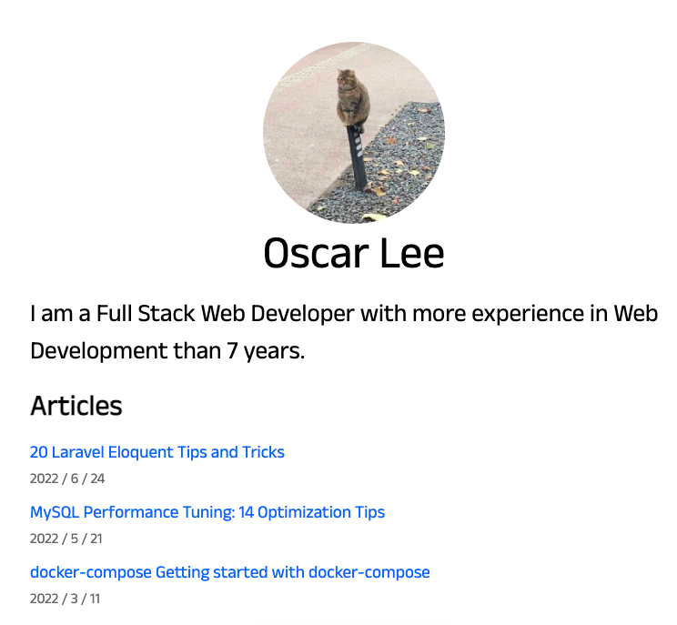

## nextjs-markdown-blog

This uses `NextJS + markdown` to create a practice project.

### Referer
- https://www.youtube.com/watch?v=MrjeefD8sac
- https://github.com/vercel/next-learn/tree/master/basics/demo